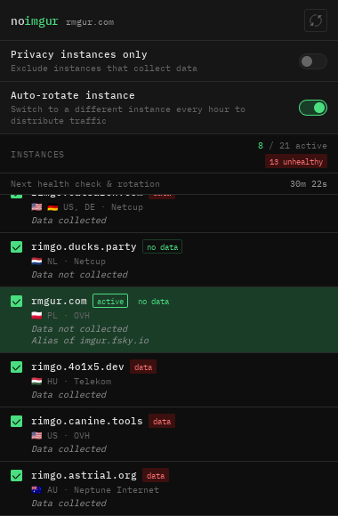
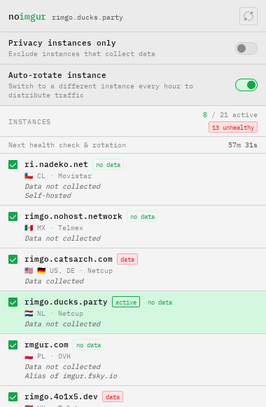

# noimgur

[](https://addons.mozilla.org/firefox/addon/noimgur/) [](https://microsoftedge.microsoft.com/addons/detail/noimgur/aefmjbiknjhljnlbeomiaggimjjgafpp) [](https://chromewebstore.google.com/detail/bjofjgmleldgbcocnpejlgiklelnohnb)

[](https://github.com/yobson1/noimgur/blob/main/LICENSE)
[](https://wxt.dev)

automatically redirect imgur images with a [rimgo](https://codeberg.org/rimgo/rimgo) instance

## Developing

This project uses [pnpm](https://pnpm.io/):

```sh
pnpm install
pnpm dev
pnpm dev:firefox
```

## Building

```sh
pnpm build
pnpm build:firefox
```

To create a bundled zip of the extension run:

```sh
pnpm zip
pnpm zip:firefox
```

The archive will be in the .output directory

## Screenshots



## Built With

- [](https://www.typescriptlang.org/)
- [](https://wxt.dev)
- [](https://bun.sh/)
- [](https://icon-sets.iconify.design/)

## Notice
NOT AFFILIATED WITH OR APPROVED BY IMGUR
